# Kit-Educatif-4eme
Ce git-hub est consacré à la documentation de la réalisation d'un kit éducatif de travaux pratiques pour le programme togolais, plus spécifiquement à l'endroit des élèves en classe de 4ème


### INTRODUCTION  

Dans le cadre de mon stage de fin de parcours à l'entreprise TIDD TOGO (Technologies et Innovations pour le Développement Durable), il m'a été confié comme projet, de réaliser un kit éducatif. Le but de ce projet, est de produire un kit grâce auquel n'importe quel élève de 4ème sera en mesure de faire l'intégralité des travaux pratiques recommandés dans le programme.  

Ce projet vient répondre à un problème récurrent dans le programme togolais. En effet, de nombreuses notions sont enseignées aux élèves mais rares sont ceux là qui ont eu l'opportunité de voir par leur propre yeux le fonctionnement d'une machine étudiée. La plupart du temps, ce n'est que pure théorie favorisant ainsi le manque d'investissement, de compréhension ainsi qu'un oubli.  
Cependant, avec un kit, l'élève possède a sa portée tous les éléments nécessaires pour reproduire les travaux pratiques chez lui. Il a donc la possibilié d'analyser de fond en comble le fonctionnement, les principes appliqués et cela le rend plus susceptible de produire un travail de qualité lors d'une application potentielle du principe étudié.

### SOMMAIRE  
1 - PRESENTATION DU PROJET  
2 - OBJECTIFS DU PROJET  
3 - LISTE DU MATERIEL  
4 - BREVE DESCRIPTION DE CHAQUE ELEMENT DU MATERIEL  


### 1 - PRESENTATION DU PROJET  
Un kit est un ensemble d'éléments contenant tout le nécessaire pour réaliser un objectif précis. Il existe de nombreux types de kits tels que des kits d'électronique, de bricolage, de chimie, de physique pour ne citer que certains. Le projet dont nous nous occupons consiste à réaliser un kit de physiques-chimie.  
Dans ce kit, l'on retrouvera des éléments de chimie tels que des électrodes ou des portions de substances chimiques, des composants électriques et des outils pour appliquer diverses lois de la physique étudiées en classe de 4ème.  

A la différence de kits semblables existants, celui ci est soumis à quelques contraintes :  
- tous les éléments de ce kit doivent être disponibles au FABLAB de TIDD
- dans le cas où l'élément n'est pas disponible au FABLAB, il doit pouvoir être trouvé de façon locale
- le kit doit être réalisé en une durée d'un mois maximum
- la documentation du kit doit être suffisamment claire pour que n'importe qui puisse reproduire ce kit


De plus, pour chaque TP prévu par le programme, il y aura un lien qui redirigera vers un tutoriel expliquant comment faire le TP. Cela a été implémenté afin d'aider les élèves qui ont besoin de plus de temps ou de pratique pour assimiler la notion et qui échouent donc à comprendre ce qui est enseigné pendant qu'ils sont encore en cours.

### 2 - OBJECTIFS DU PROJET   

Ce projet de réalisation de kit étant à but pédagogique, il y a quelques objectifs que nous visons.  
Ci après les dits objectifs :  
- aider les élèves à mieux comprendre les concepts théoriques qu'ils apprennent en cours
- améliorer la capacité des éleves à visualiser le fonctionnement des machines et outils étudiés
- aider les élèves à se familiariser avec les outils et plus généralement au montage de composants, à la réalisation de circuits
- encourager les élèves à réaliser des expériences par eux mêmes et stimuler leur curiosité scientifique 
- renforcer la compréhension des étudiants et la mémorisation par la pratique et la répétition
- motiver les élèves en les amenant à s'investir activement dans leur apprentissage
- améliorer la capacité des élèves à diagnostiquer et résoudre des problèmes par la manipulation des outils
- faciliter l'application des connaissances acquises à des situations réelles

Plus simplement, l'objectif que vise ce projet est de combler le fossé évident entre la théorie et la pratique existant dans le programme togolais en offrant aux élèves l'opportunité de s'exercer à leur envie aux travaux pratiques.

### 3 - LISTE DU MATERIEL  
Pour identifier quels sont les différents composants, substances ou outils dont l'élève aura besoin dans sa tâche, nous avons parcouru l'ensemble du programme de 4ème grâce au document : **SYN.EN.TO.M.SPT Fiches Pédagogiques PCT 4ème** .  
C'est un document destiné à l'endroit des professeurs et qui leur permet de dispenser efficacement leur cours tout au long de l'année.
  
Le document est divisé en matières. Chaque matière a plusieurs leçons et chaque leçons, plusieurs séances. La plupart des séances comportent un schéma, un TP ou une situation problème relative à la leçon étudiée. C'est grâce à ces schémas et TP que nous savons de quoi aurons besoin les élèves et en quelle quantité.  

Dans le tableau suivant se trouve la liste des éléments contenus dans le kit éducatif réalisé :  

### Matériaux

| **Catégorie**                  | **Élément**                       |
|--------------------------------|-----------------------------------|
| **Composants Électroniques**   | LED                               |
|                                | Interrupteur                      |
|                                | Transistor                        |
|                                | LDR                               |
|                                | Diode Zener                       |
|                                | Bobine ou aimant (source de tension alternative) |
| **Outils**                     | Tournevis testeur                 |
|                                | Étain                             |
| **Optique**                    | Miroir rectangulaire              |
|                                | Source de lumière (lampe)         |
| **Matériaux Divers**           | Aimant                            |
|                                | Aiguille                          |
|                                | Carton                            |
|                                | Vitre (verre de glace)            |
|                                | Papier calque                     |
| **Modèles et Structures**      | Sphère 1 (modélisée)              |
|                                | Sphère 2 de rayon différent       |
|                                | Carton servant d'écran            |
| **Expérimentation**            | Boussole                          |
|                                | Lampe                             |
|                                | Torche                            |
|                                | Bougie                            |
|                                | Cube (plein)                      |
|                                | Cube (creux)                      |
|                                | Support vertical                  |
|                                | Boule (PLA)                       |
|                                | Tige en cuivre                    |
|                                | Isolant (plastique)               |
|                                | Paille en plastique               |
| **Solutions Chimiques**        | Solution de sulfate de cuivre     |
|                                | Solution de dichromate de potassium |
|                                | Sel de cuisine                    |
|                                | Eau distillée                     |
| **Électrochimie**              | Anode en cuivre                   |
|                                | Sulfate en graphite               |  

### A - COMPOSANTS ELECTRONIQUES  
La plupart des composants électroniques de ce kit sont montés sur des circuits imprimés. Nous aurons donc le composant sur la plaque ainsi que deux broches pour relier le composant au reste du circuit. Si le besoin y est, une résistance sera également ajoutée pour protéger le composant.  

Pour ce faire, nous utiliserons les logiciels [Kicad](https://www.kicad.org) (pour le circuit imprimé), [FlatCam](http://flatcam.org) (pour le Gcode servant à contrôler la CNC) et le [Grbl control](https://grbl-controller.software.informer.com/Télécharger/) (pour manipuler la CNC).  

En prenant l'exemple de la LED, nous allons expliquer le processus par lequel nous réalisons les composants électroniques du kit, depuis le schéma au composant prêt à être utilisé. 
### A - 1. LED  
### a/ KiCad  

Pour concevoir notre LED prête à être utilisée par les élèves, on commence par créér un nouveau projet dans l'application [Kicad](https://www.kicad.org). Suite à cela, nous entrons dans l'éditeur de schéma. Là, nous sélectionnons parmi les composants, la led ainsi que deux broches femelles.  
Une fois que les composants sont reliés entre eux, nous leur assignons chacun une empreinte. Nous pouvons définir l'empreinte en tant que la trace que laisse le composant sur la plaque de cuivre. Le plus souvent, cela correspond à l'espace nécessaire pour faire passer leurs pattes à travers la [plaque de cuivre](https://www.google.com/imgres?q=plaque%20de%20cuivre&imgurl=https%3A%2F%2Fm.media-amazon.com%2Fimages%2FI%2F61Wvf4K9lOL.jpg&imgrefurl=https%3A%2F%2Fwww.amazon.com.be%2FPlaque-cuivre-m%25C3%25A9tal-rouge-Feuille%2Fdp%2FB0C9MZGG9D&docid=2mfXx0tqihvN0M&tbnid=Iq-B5xibmUsjmM&vet=12ahUKEwjJr5_S7auHAxUBhv0HHXN7AHwQM3oECFQQAA..i&w=1200&h=1200&hcb=2&ved=2ahUKEwjJr5_S7auHAxUBhv0HHXN7AHwQM3oECFQQAA).  

  

Après avoir sauvegardé le schéma, nous ouvrons l'éditeur de [PCB](https://www.google.com/url?sa=i&url=https%3A%2F%2Fwww.mainpcba.com%2Fwhy-pcb-etching-is-critically-important-for-electronics-market%2F&psig=AOvVaw2W0MaiGAb6qnLBVWqQRuDz&ust=1721229802548000&source=images&cd=vfe&opi=89978449&ved=2ahUKEwiqlffo7quHAxUyiv0HHbq) (Printed Circuit Board). Un bouton 🔳 sur la barre des tâches en haut à droite nous permet de faire une mise à jour et par conséquent d'importer les empreintes des composants dans l'éditeur de PCB.  


Une fois cela fait, nous viendrons sélectionner chaque composant et les renverser par rapport à la plaque en accédant à leurs propriétés. Etant donné que nous ne possédons qu'une couche de cuivre, nous sommes contraints de mettre les composants d'un côté et de tracer les [pistes](https://github.com/user-attachments/assets/6313654a-c0ef-43aa-a335-a3c913bbcb89) de l'autre.  
Muni de l'outil route piste (X), nous pouvons tracer les connexions entre les différents composants. Voici le résultat que l'on obtiendra :

   

 En ce qui concerne la visualisation 3D, on obtiendra :
  
et en dessous :  
   


Quand vous aurez fini toutes ces étapes, rendez vous en haut à gauche et appuyez sur **Fichiers** 📂 puis sur **Fichiers de Fabrication** et enfin **Gerber**.
Là vous tracez pour la face de cuivre F.cu et pour le Edge Cuts puis le fichier de perçage dans un dossier spécfique  
  

Vous devriez avoir trois fichiers dans ce dossier. Nous ouvrirons les fichiers en question grâce au logiciel [FlatCam](http://flatcam.org)


### b/ FlatCam  
Une fois [FlatCam](http://flatcam.org) ouvert, regardez en haut à gauche. Sur la barre, il est écrit à un endroit **File**. Suivez le chemin File ▶️ Open ▶️ Open Gerber (deux fichiers : F.cu et EdgeCuts) et Open Excellon (le fichier PTH). Ils correspondent aux fichiers créés par KiCad précemment.  

  

Après avoir chargé ces fichiers, nous allons rediriger l'origine du repère. La CNC que nous utilisons à [TIDD LAB](https://www.linkedin.com/company/tiddafrica/?originalSubdomain=fr) fonctionne par un balayage Sud Ouest vers Nord Est. Nous allons donc préférer définir l'origine de sorte que notre plan d'usinage se trouve dans la partie strictement positive du repère ( cadran en haut à droite). Pour cela, choisissons l'outil **Set Origin** situé dans la barre d'outils en haut.  

  

Pour bien définir l'origine, il nous faut supposer qu'un carré encadre tout notre plan. Nous mettrons alors l'origine dans le coin inférieur gauche de ce carré imaginaire. L'on obtient alors le résultat suivant :
  
Nous allons à présent passer à la géométrie et à la mise en place des trous pour les pattes des composants. Double cliquons sur le fichier de F.cu puis sur l'option **Isolation Routing** qui apparaît.  

   


Il suffit ensuite d'entrer les paramètres suivants :  
- Diameter : 0.2 et C1
- Passes : 5
- Overlap : 10%
Puis vous faites **Generate Geometry**
Notez bien que tous les paramètres mis dans cette documentation sont spécifiques aux contraintes de matériel du FABLAB et du type de circuit imprimé désiré.

  

Au niveau de **Parameters for : Tool 1**, entrons :  
- Cut Z : -0.1
- Multi-Depth(coché) : 0.8
- Travel Z : 2
- Feedrate X-Y : 90
- Feedrate Z : 60
- Spindle speed : 1000

Faisons **Generate CNCJob Object** pour créér le Gcode dont va se servir la CNC pour effectuer le travail. Ce Gcode contient une série d'intructions contenant des informations tels que des coordonnées ou des paramètres d'usinage comme ceux listés au dessus.  

  

  

Faisons **Save CNC Code** pour enregistrer le Gcode dans un dossier spécifique. Enregistrons le fichier avec un nom simple.  

  

Passons maintenant au perçage en double cliquant sur le fichier Excellon  

  

 Cliquons sur **Drilling Tools** pour sélectionner les paramètres de perçage. Ensuite, entrons les paramètres suivants :  
- Cut Z : -1.8
- Multi-Depth(coché) : 0.7
- Travel Z : 2
- Feedrate Z : 90
- Spindle speed : 1000
Puis faisons Generate CNCJoB object etc... comme pour l'étape précédente.

  

  

  

  

Terminons par le EdgeCuts. Double cliquons sur le fichier du EdgeCuts puis cliquons sur le **Cutout Tool**. Une fois encore, entrons les paramètres :  
- Cut Z : -1.8
- Multi-Depth(coché) : 0.6
- Margin : 0
- Gap size: 4
- Gap type : Bridge
- Gaps : None

Enfin, on génère la géométrie et on répète les étapes précédentes.

  

  

  

  

  

Il doit y avoir enfin 3 fichiers dans le dossier où vous avez sauvegardé le CNC Code :  


L'ordre selon lequel nous avons créés ces fichiers sera l'ordre à respecter lors de l'usinage à la CNC.  

### c/ GrblControl

### Diagramme 📊 explicatif du fonctionnement de GrblControl  

```mermaid
graph TD
    A[Nettoyer le martyr]
    B[Mettre du scotch double face sur la plaque de cuivre]
    C[Fixer la plaque de cuivre au martyr]
    D[Connecter la CNC à l'ordinateur]
    E[Appuyer sur débloquer pour enlever la sécurité]
    F[Mettre la fraise pointe javelot sur la broche]
    G[Charger le fichier F.cu]
    H[Définir un origine travail]
    I[Définir l'origine des XY en faisant bouger le mandrin]
    J[Rapprocher la broche et la mèche de la plaque]
    K[Définir l'origine des Z]
    L[Utiliser les pinces crocos une sur la plaque et une sur la mèche]
    M[Faire le mappage]
    N[Une fois terminé, définir l'origine des Z]
    O[Mettre la broche en sureté en la décollant]
    P[Faire auto pour bien encadrer le plan]
    Q[Faire le mappage surfacique]
    R[Utiliser le mappage surfacique]
    S[Démarrer l'usinage]
    
    T[Charger le fichier de perçage PTH drl]
    U[Mettre la fraise pour le perçage des trous]
    V[Refaire le mappage pour définir la nouvelle origine des Z]
    W[Mettre la broche en sureté en la décollant]
    X[Démarrer le perçage]

    Y[Charger le fichier EdgeCuts]
    Z[Mettre la fraise pour le tracé du contour]
    AA[Refaire le mappage pour définir la nouvelle origine des Z]
    BB[Mettre la broche en sureté en la décollant]
    CC[Démarrer le tracé/découpage]

    A --> B --> C --> D --> E --> F --> G --> H --> I --> J --> K --> L --> M --> N --> O --> P --> Q --> R --> S
    S --> T --> U --> V --> W --> X
    X --> Y --> Z --> AA --> BB --> CC
```     


### Code du PTH drl  

```gcode
(G-CODE GENERATED BY FLATCAM v8.994 - www.flatcam.org - Version Date: 2020/11/7)

(Name: afficheur-PTH.drl_cnc)
(Type: G-code from Geometry)
(Units: MM)

(Created on Thursday, 04 July 2024 at 10:02)

(This preprocessor is the default preprocessor used by FlatCAM.)
(It is made to work with MACH3 compatible motion controllers.)


(TOOLS DIAMETER: )
(Tool: 1 -> Dia: 0.70104)
(Tool: 2 -> Dia: 0.8000999999999999)
(Tool: 3 -> Dia: 1.0007599999999999)

(FEEDRATE Z: )
(Tool: 1 -> Feedrate: 90.0)
(Tool: 2 -> Feedrate: 90.0)
(Tool: 3 -> Feedrate: 90.0)

(FEEDRATE RAPIDS: )
(Tool: 1 -> Feedrate Rapids: 1500)
(Tool: 2 -> Feedrate Rapids: 1500)
(Tool: 3 -> Feedrate Rapids: 1500)

(Z_CUT: )
(Tool: 1 -> Z_Cut: -1.8)
(Tool: 2 -> Z_Cut: -1.8)
(Tool: 3 -> Z_Cut: -1.8)

(Tools Offset: )
(Tool: 1 -> Offset Z: 0.0)
(Tool: 2 -> Offset Z: 0.0)
(Tool: 3 -> Offset Z: 0.0)

(DEPTH_PER_CUT: )
(Tool: 1 -> DeptPerCut: 0.7)
(Tool: 2 -> DeptPerCut: 0.7)
(Tool: 3 -> DeptPerCut: 0.7)

(Z_MOVE: )
(Tool: 1 -> Z_Move: 2)
(Tool: 2 -> Z_Move: 2)
(Tool: 3 -> Z_Move: 2)

(Z Toolchange: 15 mm)
(X,Y Toolchange: 0.0000, 0.0000 mm)
(Z Start: None mm)
(Z End: 0.5 mm)
(X,Y End: None mm)
(Steps per circle: 64)
(Preprocessor Excellon: default)

(X range:    9.7251 ...   43.7510  mm)
(Y range:    6.7104 ...   29.5247  mm)

(Spindle Speed: 1000 RPM)
G21
G90
G94

G01 F90.00

M5
G00 Z15.0000
T1
G00 X0.0000 Y0.0000                
M6
(MSG, Change to Tool Dia = 0.7010 ||| Total drills for tool T1 = 49)
M0
G00 Z15.0000

G01 F90.00
M03 S1000
G00 X30.1290 Y28.4198
G01 Z-0.7000
G01 Z0
G00 Z2.0000
G01 Z-1.4000
G01 Z0
G00 Z2.0000
G01 Z-1.8000
G01 Z0
G00 Z2.0000
G00 X26.1208 Y27.5791
G01 Z-0.7000
G01 Z0
G00 Z2.0000
G01 Z-1.4000
G01 Z0
G00 Z2.0000
G01 Z-1.8000
G01 Z0
G00 Z2.0000
G00 X18.5008 Y27.5791
G01 Z-0.7000
G01 Z0
G00 Z2.0000
G01 Z-1.4000
G01 Z0
G00 Z2.0000
G01 Z-1.8000
G01 Z0
G00 Z2.0000
G00 X10.2509 Y29.0243
G01 Z-0.7000
G01 Z0
G00 Z2.0000
G01 Z-1.4000
G01 Z0
G00 Z2.0000
G01 Z-1.8000
G01 Z0
G00 Z2.0000
G00 X10.2509 Y26.4843
G01 Z-0.7000
G01 Z0
G00 Z2.0000
G01 Z-1.4000
G01 Z0
G00 Z2.0000
G01 Z-1.8000
G01 Z0
G00 Z2.0000
G00 X10.2509 Y22.6210
G01 Z-0.7000
G01 Z0
G00 Z2.0000
G01 Z-1.4000
G01 Z0
G00 Z2.0000
G01 Z-1.8000
G01 Z0
G00 Z2.0000
G00 X10.2509 Y20.0810
G01 Z-0.7000
G01 Z0
G00 Z2.0000
G01 Z-1.4000
G01 Z0
G00 Z2.0000
G01 Z-1.8000
G01 Z0
G00 Z2.0000
G00 X10.2509 Y17.5410
G01 Z-0.7000
G01 Z0
G00 Z2.0000
G01 Z-1.4000
G01 Z0
G00 Z2.0000
G01 Z-1.8000
G01 Z0
G00 Z2.0000
G00 X10.2509 Y15.0010
G01 Z-0.7000
G01 Z0
G00 Z2.0000
G01 Z-1.4000
G01 Z0
G00 Z2.0000
G01 Z-1.8000
G01 Z0
G00 Z2.0000
G00 X10.2255 Y9.7508
G01 Z-0.7000
G01 Z0
G00 Z2.0000
G01 Z-1.4000
G01 Z0
G00 Z2.0000
G01 Z-1.8000
G01 Z0
G00 Z2.0000
G00 X10.2255 Y7.2108
G01 Z-0.7000
G01 Z0
G00 Z2.0000
G01 Z-1.4000
G01 Z0
G00 Z2.0000
G01 Z-1.8000
G01 Z0
G00 Z2.0000
G00 X18.5008 Y9.7991
G01 Z-0.7000
G01 Z0
G00 Z2.0000
G01 Z-1.4000
G01 Z0
G00 Z2.0000
G01 Z-1.8000
G01 Z0
G00 Z2.0000
G00 X18.5008 Y12.3391
G01 Z-0.7000
G01 Z0
G00 Z2.0000
G01 Z-1.4000
G01 Z0
G00 Z2.0000
G01 Z-1.8000
G01 Z0
G00 Z2.0000
G00 X18.5008 Y14.8791
G01 Z-0.7000
G01 Z0
G00 Z2.0000
G01 Z-1.4000
G01 Z0
G00 Z2.0000
G01 Z-1.8000
G01 Z0
G00 Z2.0000
G00 X18.5008 Y17.4191
G01 Z-0.7000
G01 Z0
G00 Z2.0000
G01 Z-1.4000
G01 Z0
G00 Z2.0000
G01 Z-1.8000
G01 Z0
G00 Z2.0000
G00 X18.5008 Y19.9591
G01 Z-0.7000
G01 Z0
G00 Z2.0000
G01 Z-1.4000
G01 Z0
G00 Z2.0000
G01 Z-1.8000
G01 Z0
G00 Z2.0000
G00 X18.5008 Y22.4991
G01 Z-0.7000
G01 Z0
G00 Z2.0000
G01 Z-1.4000
G01 Z0
G00 Z2.0000
G01 Z-1.8000
G01 Z0
G00 Z2.0000
G00 X18.5008 Y25.0391
G01 Z-0.7000
G01 Z0
G00 Z2.0000
G01 Z-1.4000
G01 Z0
G00 Z2.0000
G01 Z-1.8000
G01 Z0
G00 Z2.0000
G00 X26.1208 Y25.0391
G01 Z-0.7000
G01 Z0
G00 Z2.0000
G01 Z-1.4000
G01 Z0
G00 Z2.0000
G01 Z-1.8000
G01 Z0
G00 Z2.0000
G00 X26.1208 Y22.4991
G01 Z-0.7000
G01 Z0
G00 Z2.0000
G01 Z-1.4000
G01 Z0
G00 Z2.0000
G01 Z-1.8000
G01 Z0
G00 Z2.0000
G00 X26.1208 Y19.9591
G01 Z-0.7000
G01 Z0
G00 Z2.0000
G01 Z-1.4000
G01 Z0
G00 Z2.0000
G01 Z-1.8000
G01 Z0
G00 Z2.0000
G00 X26.1208 Y17.4191
G01 Z-0.7000
G01 Z0
G00 Z2.0000
G01 Z-1.4000
G01 Z0
G00 Z2.0000
G01 Z-1.8000
G01 Z0
G00 Z2.0000
G00 X26.1208 Y14.8791
G01 Z-0.7000
G01 Z0
G00 Z2.0000
G01 Z-1.4000
G01 Z0
G00 Z2.0000
G01 Z-1.8000
G01 Z0
G00 Z2.0000
G00 X26.1208 Y12.3391
G01 Z-0.7000
G01 Z0
G00 Z2.0000
G01 Z-1.4000
G01 Z0
G00 Z2.0000
G01 Z-1.8000
G01 Z0
G00 Z2.0000
G00 X26.1208 Y9.7991
G01 Z-0.7000
G01 Z0
G00 Z2.0000
G01 Z-1.4000
G01 Z0
G00 Z2.0000
G01 Z-1.8000
G01 Z0
G00 Z2.0000
G00 X30.3093 Y7.9195
G01 Z-0.7000
G01 Z0
G00 Z2.0000
G01 Z-1.4000
G01 Z0
G00 Z2.0000
G01 Z-1.8000
G01 Z0
G00 Z2.0000
G00 X30.3093 Y10.9192
G01 Z-0.7000
G01 Z0
G00 Z2.0000
G01 Z-1.4000
G01 Z0
G00 Z2.0000
G01 Z-1.8000
G01 Z0
G00 Z2.0000
G00 X30.1899 Y14.1704
G01 Z-0.7000
G01 Z0
G00 Z2.0000
G01 Z-1.4000
G01 Z0
G00 Z2.0000
G01 Z-1.8000
G01 Z0
G00 Z2.0000
G00 X30.2509 Y17.1702
G01 Z-0.7000
G01 Z0
G00 Z2.0000
G01 Z-1.4000
G01 Z0
G00 Z2.0000
G01 Z-1.8000
G01 Z0
G00 Z2.0000
G00 X30.2509 Y20.1699
G01 Z-0.7000
G01 Z0
G00 Z2.0000
G01 Z-1.4000
G01 Z0
G00 Z2.0000
G01 Z-1.8000
G01 Z0
G00 Z2.0000
G00 X30.2509 Y22.9207
G01 Z-0.7000
G01 Z0
G00 Z2.0000
G01 Z-1.4000
G01 Z0
G00 Z2.0000
G01 Z-1.8000
G01 Z0
G00 Z2.0000
G00 X30.1290 Y25.6690
G01 Z-0.7000
G01 Z0
G00 Z2.0000
G01 Z-1.4000
G01 Z0
G00 Z2.0000
G01 Z-1.8000
G01 Z0
G00 Z2.0000
G00 X37.7490 Y25.6690
G01 Z-0.7000
G01 Z0
G00 Z2.0000
G01 Z-1.4000
G01 Z0
G00 Z2.0000
G01 Z-1.8000
G01 Z0
G00 Z2.0000
G00 X37.8709 Y22.9207
G01 Z-0.7000
G01 Z0
G00 Z2.0000
G01 Z-1.4000
G01 Z0
G00 Z2.0000
G01 Z-1.8000
G01 Z0
G00 Z2.0000
G00 X37.8709 Y20.1699
G01 Z-0.7000
G01 Z0
G00 Z2.0000
G01 Z-1.4000
G01 Z0
G00 Z2.0000
G01 Z-1.8000
G01 Z0
G00 Z2.0000
G00 X37.8709 Y17.1702
G01 Z-0.7000
G01 Z0
G00 Z2.0000
G01 Z-1.4000
G01 Z0
G00 Z2.0000
G01 Z-1.8000
G01 Z0
G00 Z2.0000
G00 X37.8099 Y14.1704
G01 Z-0.7000
G01 Z0
G00 Z2.0000
G01 Z-1.4000
G01 Z0
G00 Z2.0000
G01 Z-1.8000
G01 Z0
G00 Z2.0000
G00 X37.9293 Y10.9192
G01 Z-0.7000
G01 Z0
G00 Z2.0000
G01 Z-1.4000
G01 Z0
G00 Z2.0000
G01 Z-1.8000
G01 Z0
G00 Z2.0000
G00 X37.9293 Y7.9195
G01 Z-0.7000
G01 Z0
G00 Z2.0000
G01 Z-1.4000
G01 Z0
G00 Z2.0000
G01 Z-1.8000
G01 Z0
G00 Z2.0000
G00 X43.2506 Y7.4293
G01 Z-0.7000
G01 Z0
G00 Z2.0000
G01 Z-1.4000
G01 Z0
G00 Z2.0000
G01 Z-1.8000
G01 Z0
G00 Z2.0000
G00 X43.2506 Y9.9693
G01 Z-0.7000
G01 Z0
G00 Z2.0000
G01 Z-1.4000
G01 Z0
G00 Z2.0000
G01 Z-1.8000
G01 Z0
G00 Z2.0000
G00 X43.2506 Y12.5093
G01 Z-0.7000
G01 Z0
G00 Z2.0000
G01 Z-1.4000
G01 Z0
G00 Z2.0000
G01 Z-1.8000
G01 Z0
G00 Z2.0000
G00 X43.2506 Y15.0493
G01 Z-0.7000
G01 Z0
G00 Z2.0000
G01 Z-1.4000
G01 Z0
G00 Z2.0000
G01 Z-1.8000
G01 Z0
G00 Z2.0000
G00 X43.2506 Y17.5893
G01 Z-0.7000
G01 Z0
G00 Z2.0000
G01 Z-1.4000
G01 Z0
G00 Z2.0000
G01 Z-1.8000
G01 Z0
G00 Z2.0000
G00 X43.2506 Y20.1293
G01 Z-0.7000
G01 Z0
G00 Z2.0000
G01 Z-1.4000
G01 Z0
G00 Z2.0000
G01 Z-1.8000
G01 Z0
G00 Z2.0000
G00 X43.2506 Y22.6693
G01 Z-0.7000
G01 Z0
G00 Z2.0000
G01 Z-1.4000
G01 Z0
G00 Z2.0000
G01 Z-1.8000
G01 Z0
G00 Z2.0000
G00 X43.2506 Y25.2093
G01 Z-0.7000
G01 Z0
G00 Z2.0000
G01 Z-1.4000
G01 Z0
G00 Z2.0000
G01 Z-1.8000
G01 Z0
G00 Z2.0000
G00 X43.2506 Y27.7493
G01 Z-0.7000
G01 Z0
G00 Z2.0000
G01 Z-1.4000
G01 Z0
G00 Z2.0000
G01 Z-1.8000
G01 Z0
G00 Z2.0000
G00 X37.7490 Y28.4198
G01 Z-0.7000
G01 Z0
G00 Z2.0000
G01 Z-1.4000
G01 Z0
G00 Z2.0000
G01 Z-1.8000
G01 Z0
G00 Z2.0000
M05
G00 Z0.50
```

### Code du EdgeCuts  

```gcode
(G-CODE GENERATED BY FLATCAM v8.994 - www.flatcam.org - Version Date: 2020/11/7)

(Name: afficheur-Edge_Cuts.gbr_cutout_1_cnc)
(Type: G-code from Geometry)
(Units: MM)

(Created on Thursday, 04 July 2024 at 10:05)

(This preprocessor is the default preprocessor used by FlatCAM.)
(It is made to work with MACH3 compatible motion controllers.)

(TOOL DIAMETER: 1.6 mm)
(Feedrate_XY: 90.0 mm/min)
(Feedrate_Z: 60.0 mm/min)
(Feedrate rapids 1500.0 mm/min)

(Z_Cut: -1.8 mm)
(DepthPerCut: 0.6 mm <=>3 passes)
(Z_Move: 2.0 mm)
(Z Start: None mm)
(Z End: 15.0 mm)
(X,Y End: None mm)
(Steps per circle: 64)
(Preprocessor Geometry: default)

(X range:    1.6000 ...   48.4000  mm)
(Y range:    1.6000 ...   35.4000  mm)

(Spindle Speed: 1000.0 RPM)
G21
G90
G94

G01 F90.00

M5
G00 Z15.0000
G00 X0.0000 Y0.0000
T1
M6    
(MSG, Change to Tool Dia = 1.6000)
M0
G00 Z15.0000

M03 S1000.0
G01 F90.00
G00 X1.6000 Y34.5000
G01 F60.00
G01 Z-0.6000
G01 F90.00
G01 X1.6014 Y34.5491
G01 X1.6091 Y34.6272
G01 X1.6105 Y34.6369
G01 X1.6258 Y34.7139
G01 X1.6282 Y34.7234
G01 X1.6510 Y34.7986
G01 X1.6543 Y34.8078
G01 X1.6844 Y34.8803
G01 X1.6886 Y34.8892
G01 X1.7256 Y34.9584
G01 X1.7306 Y34.9669
G01 X1.7742 Y35.0321
G01 X1.7801 Y35.0400
G01 X1.8299 Y35.1007
G01 X1.8365 Y35.1080
G01 X1.8920 Y35.1635
G01 X1.8993 Y35.1701
G01 X1.9600 Y35.2199
G01 X1.9679 Y35.2258
G01 X2.0331 Y35.2694
G01 X2.0416 Y35.2744
G01 X2.1108 Y35.3114
G01 X2.1197 Y35.3156
G01 X2.1922 Y35.3457
G01 X2.2014 Y35.3490
G01 X2.2766 Y35.3718
G01 X2.2861 Y35.3742
G01 X2.3631 Y35.3895
G01 X2.3728 Y35.3909
G01 X2.4509 Y35.3986
G01 X2.5000 Y35.4000
G01 X47.5000 Y35.4000
G01 X47.5491 Y35.3986
G01 X47.6272 Y35.3909
G01 X47.6369 Y35.3895
G01 X47.7139 Y35.3742
G01 X47.7234 Y35.3718
G01 X47.7986 Y35.3490
G01 X47.8078 Y35.3457
G01 X47.8803 Y35.3156
G01 X47.8892 Y35.3114
G01 X47.9584 Y35.2744
G01 X47.9669 Y35.2694
G01 X48.0321 Y35.2258
G01 X48.0400 Y35.2199
G01 X48.1007 Y35.1701
G01 X48.1080 Y35.1635
G01 X48.1635 Y35.1080
G01 X48.1701 Y35.1007
G01 X48.2199 Y35.0400
G01 X48.2258 Y35.0321
G01 X48.2694 Y34.9669
G01 X48.2744 Y34.9584
G01 X48.3114 Y34.8892
G01 X48.3156 Y34.8803
G01 X48.3457 Y34.8078
G01 X48.3490 Y34.7986
G01 X48.3718 Y34.7234
G01 X48.3742 Y34.7139
G01 X48.3895 Y34.6369
G01 X48.3909 Y34.6272
G01 X48.3986 Y34.5491
G01 X48.4000 Y34.5000
G01 X48.4000 Y2.5000
G01 X48.3986 Y2.4509
G01 X48.3909 Y2.3728
G01 X48.3895 Y2.3631
G01 X48.3742 Y2.2861
G01 X48.3718 Y2.2766
G01 X48.3490 Y2.2014
G01 X48.3457 Y2.1922
G01 X48.3156 Y2.1197
G01 X48.3114 Y2.1108
G01 X48.2744 Y2.0416
G01 X48.2694 Y2.0331
G01 X48.2258 Y1.9679
G01 X48.2199 Y1.9600
G01 X48.1701 Y1.8993
G01 X48.1635 Y1.8920
G01 X48.1080 Y1.8365
G01 X48.1007 Y1.8299
G01 X48.0400 Y1.7801
G01 X48.0321 Y1.7742
G01 X47.9669 Y1.7306
G01 X47.9584 Y1.7256
G01 X47.8892 Y1.6886
G01 X47.8803 Y1.6844
G01 X47.8078 Y1.6543
G01 X47.7986 Y1.6510
G01 X47.7234 Y1.6282
G01 X47.7139 Y1.6258
G01 X47.6369 Y1.6105
G01 X47.6272 Y1.6091
G01 X47.5491 Y1.6014
G01 X47.5000 Y1.6000
G01 X2.5000 Y1.6000
G01 X2.4509 Y1.6014
G01 X2.3728 Y1.6091
G01 X2.3631 Y1.6105
G01 X2.2861 Y1.6258
G01 X2.2766 Y1.6282
G01 X2.2014 Y1.6510
G01 X2.1922 Y1.6543
G01 X2.1197 Y1.6844
G01 X2.1108 Y1.6886
G01 X2.0416 Y1.7256
G01 X2.0331 Y1.7306
G01 X1.9679 Y1.7742
G01 X1.9600 Y1.7801
G01 X1.8993 Y1.8299
G01 X1.8920 Y1.8365
G01 X1.8365 Y1.8920
G01 X1.8299 Y1.8993
G01 X1.7801 Y1.9600
G01 X1.7742 Y1.9679
G01 X1.7306 Y2.0331
G01 X1.7256 Y2.0416
G01 X1.6886 Y2.1108
G01 X1.6844 Y2.1197
G01 X1.6543 Y2.1922
G01 X1.6510 Y2.2014
G01 X1.6282 Y2.2766
G01 X1.6258 Y2.2861
G01 X1.6105 Y2.3631
G01 X1.6091 Y2.3728
G01 X1.6014 Y2.4509
G01 X1.6000 Y2.5000
G01 X1.6000 Y34.5000
G00 X1.6000 Y34.5000
G01 F60.00
G01 Z-1.2000
G01 F90.00
G01 X1.6000 Y2.5000
G01 X1.6014 Y2.4509
G01 X1.6091 Y2.3728
G01 X1.6105 Y2.3631
G01 X1.6258 Y2.2861
G01 X1.6282 Y2.2766
G01 X1.6510 Y2.2014
G01 X1.6543 Y2.1922
G01 X1.6844 Y2.1197
G01 X1.6886 Y2.1108
G01 X1.7256 Y2.0416
G01 X1.7306 Y2.0331
G01 X1.7742 Y1.9679
G01 X1.7801 Y1.9600
G01 X1.8299 Y1.8993
G01 X1.8365 Y1.8920
G01 X1.8920 Y1.8365
G01 X1.8993 Y1.8299
G01 X1.9600 Y1.7801
G01 X1.9679 Y1.7742
G01 X2.0331 Y1.7306
G01 X2.0416 Y1.7256
G01 X2.1108 Y1.6886
G01 X2.1197 Y1.6844
G01 X2.1922 Y1.6543
G01 X2.2014 Y1.6510
G01 X2.2766 Y1.6282
G01 X2.2861 Y1.6258
G01 X2.3631 Y1.6105
G01 X2.3728 Y1.6091
G01 X2.4509 Y1.6014
G01 X2.5000 Y1.6000
G01 X47.5000 Y1.6000
G01 X47.5491 Y1.6014
G01 X47.6272 Y1.6091
G01 X47.6369 Y1.6105
G01 X47.7139 Y1.6258
G01 X47.7234 Y1.6282
G01 X47.7986 Y1.6510
G01 X47.8078 Y1.6543
G01 X47.8803 Y1.6844
G01 X47.8892 Y1.6886
G01 X47.9584 Y1.7256
G01 X47.9669 Y1.7306
G01 X48.0321 Y1.7742
G01 X48.0400 Y1.7801
G01 X48.1007 Y1.8299
G01 X48.1080 Y1.8365
G01 X48.1635 Y1.8920
G01 X48.1701 Y1.8993
G01 X48.2199 Y1.9600
G01 X48.2258 Y1.9679
G01 X48.2694 Y2.0331
G01 X48.2744 Y2.0416
G01 X48.3114 Y2.1108
G01 X48.3156 Y2.1197
G01 X48.3457 Y2.1922
G01 X48.3490 Y2.2014
G01 X48.3718 Y2.2766
G01 X48.3742 Y2.2861
G01 X48.3895 Y2.3631
G01 X48.3909 Y2.3728
G01 X48.3986 Y2.4509
G01 X48.4000 Y2.5000
G01 X48.4000 Y34.5000
G01 X48.3986 Y34.5491
G01 X48.3909 Y34.6272
G01 X48.3895 Y34.6369
G01 X48.3742 Y34.7139
G01 X48.3718 Y34.7234
G01 X48.3490 Y34.7986
G01 X48.3457 Y34.8078
G01 X48.3156 Y34.8803
G01 X48.3114 Y34.8892
G01 X48.2744 Y34.9584
G01 X48.2694 Y34.9669
G01 X48.2258 Y35.0321
G01 X48.2199 Y35.0400
G01 X48.1701 Y35.1007
G01 X48.1635 Y35.1080
G01 X48.1080 Y35.1635
G01 X48.1007 Y35.1701
G01 X48.0400 Y35.2199
G01 X48.0321 Y35.2258
G01 X47.9669 Y35.2694
G01 X47.9584 Y35.2744
G01 X47.8892 Y35.3114
G01 X47.8803 Y35.3156
G01 X47.8078 Y35.3457
G01 X47.7986 Y35.3490
G01 X47.7234 Y35.3718
G01 X47.7139 Y35.3742
G01 X47.6369 Y35.3895
G01 X47.6272 Y35.3909
G01 X47.5491 Y35.3986
G01 X47.5000 Y35.4000
G01 X2.5000 Y35.4000
G01 X2.4509 Y35.3986
G01 X2.3728 Y35.3909
G01 X2.3631 Y35.3895
G01 X2.2861 Y35.3742
G01 X2.2766 Y35.3718
G01 X2.2014 Y35.3490
G01 X2.1922 Y35.3457
G01 X2.1197 Y35.3156
G01 X2.1108 Y35.3114
G01 X2.0416 Y35.2744
G01 X2.0331 Y35.2694
G01 X1.9679 Y35.2258
G01 X1.9600 Y35.2199
G01 X1.8993 Y35.1701
G01 X1.8920 Y35.1635
G01 X1.8365 Y35.1080
G01 X1.8299 Y35.1007
G01 X1.7801 Y35.0400
G01 X1.7742 Y35.0321
G01 X1.7306 Y34.9669
G01 X1.7256 Y34.9584
G01 X1.6886 Y34.8892
G01 X1.6844 Y34.8803
G01 X1.6543 Y34.8078
G01 X1.6510 Y34.7986
G01 X1.6282 Y34.7234
G01 X1.6258 Y34.7139
G01 X1.6105 Y34.6369
G01 X1.6091 Y34.6272
G01 X1.6014 Y34.5491
G01 X1.6000 Y34.5000
G00 X1.6000 Y34.5000
G01 F60.00
G01 Z-1.8000
G01 F90.00
G01 X1.6014 Y34.5491
G01 X1.6091 Y34.6272
G01 X1.6105 Y34.6369
G01 X1.6258 Y34.7139
G01 X1.6282 Y34.7234
G01 X1.6510 Y34.7986
G01 X1.6543 Y34.8078
G01 X1.6844 Y34.8803
G01 X1.6886 Y34.8892
G01 X1.7256 Y34.9584
G01 X1.7306 Y34.9669
G01 X1.7742 Y35.0321
G01 X1.7801 Y35.0400
G01 X1.8299 Y35.1007
G01 X1.8365 Y35.1080
G01 X1.8920 Y35.1635
G01 X1.8993 Y35.1701
G01 X1.9600 Y35.2199
G01 X1.9679 Y35.2258
G01 X2.0331 Y35.2694
G01 X2.0416 Y35.2744
G01 X2.1108 Y35.3114
G01 X2.1197 Y35.3156
G01 X2.1922 Y35.3457
G01 X2.2014 Y35.3490
G01 X2.2766 Y35.3718
G01 X2.2861 Y35.3742
G01 X2.3631 Y35.3895
G01 X2.3728 Y35.3909
G01 X2.4509 Y35.3986
G01 X2.5000 Y35.4000
G01 X47.5000 Y35.4000
G01 X47.5491 Y35.3986
G01 X47.6272 Y35.3909
G01 X47.6369 Y35.3895
G01 X47.7139 Y35.3742
G01 X47.7234 Y35.3718
G01 X47.7986 Y35.3490
G01 X47.8078 Y35.3457
G01 X47.8803 Y35.3156
G01 X47.8892 Y35.3114
G01 X47.9584 Y35.2744
G01 X47.9669 Y35.2694
G01 X48.0321 Y35.2258
G01 X48.0400 Y35.2199
G01 X48.1007 Y35.1701
G01 X48.1080 Y35.1635
G01 X48.1635 Y35.1080
G01 X48.1701 Y35.1007
G01 X48.2199 Y35.0400
G01 X48.2258 Y35.0321
G01 X48.2694 Y34.9669
G01 X48.2744 Y34.9584
G01 X48.3114 Y34.8892
G01 X48.3156 Y34.8803
G01 X48.3457 Y34.8078
G01 X48.3490 Y34.7986
G01 X48.3718 Y34.7234
G01 X48.3742 Y34.7139
G01 X48.3895 Y34.6369
G01 X48.3909 Y34.6272
G01 X48.3986 Y34.5491
G01 X48.4000 Y34.5000
G01 X48.4000 Y2.5000
G01 X48.3986 Y2.4509
G01 X48.3909 Y2.3728
G01 X48.3895 Y2.3631
G01 X48.3742 Y2.2861
G01 X48.3718 Y2.2766
G01 X48.3490 Y2.2014
G01 X48.3457 Y2.1922
G01 X48.3156 Y2.1197
G01 X48.3114 Y2.1108
G01 X48.2744 Y2.0416
G01 X48.2694 Y2.0331
G01 X48.2258 Y1.9679
G01 X48.2199 Y1.9600
G01 X48.1701 Y1.8993
G01 X48.1635 Y1.8920
G01 X48.1080 Y1.8365
G01 X48.1007 Y1.8299
G01 X48.0400 Y1.7801
G01 X48.0321 Y1.7742
G01 X47.9669 Y1.7306
G01 X47.9584 Y1.7256
G01 X47.8892 Y1.6886
G01 X47.8803 Y1.6844
G01 X47.8078 Y1.6543
G01 X47.7986 Y1.6510
G01 X47.7234 Y1.6282
G01 X47.7139 Y1.6258
G01 X47.6369 Y1.6105
G01 X47.6272 Y1.6091
G01 X47.5491 Y1.6014
G01 X47.5000 Y1.6000
G01 X2.5000 Y1.6000
G01 X2.4509 Y1.6014
G01 X2.3728 Y1.6091
G01 X2.3631 Y1.6105
G01 X2.2861 Y1.6258
G01 X2.2766 Y1.6282
G01 X2.2014 Y1.6510
G01 X2.1922 Y1.6543
G01 X2.1197 Y1.6844
G01 X2.1108 Y1.6886
G01 X2.0416 Y1.7256
G01 X2.0331 Y1.7306
G01 X1.9679 Y1.7742
G01 X1.9600 Y1.7801
G01 X1.8993 Y1.8299
G01 X1.8920 Y1.8365
G01 X1.8365 Y1.8920
G01 X1.8299 Y1.8993
G01 X1.7801 Y1.9600
G01 X1.7742 Y1.9679
G01 X1.7306 Y2.0331
G01 X1.7256 Y2.0416
G01 X1.6886 Y2.1108
G01 X1.6844 Y2.1197
G01 X1.6543 Y2.1922
G01 X1.6510 Y2.2014
G01 X1.6282 Y2.2766
G01 X1.6258 Y2.2861
G01 X1.6105 Y2.3631
G01 X1.6091 Y2.3728
G01 X1.6014 Y2.4509
G01 X1.6000 Y2.5000
G01 X1.6000 Y34.5000
G00 Z2.0000
M05
G00 Z2.0000
G00 Z15.00

```
  
  

  

  

  

  


